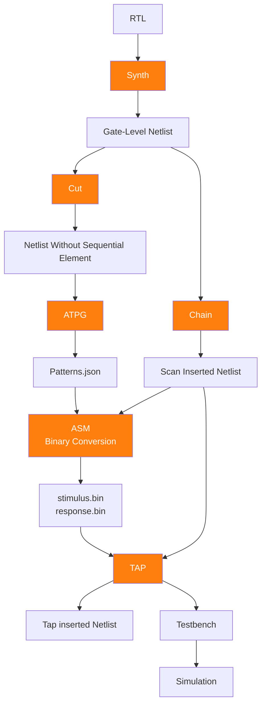

# 🛡️ Open-Source DFT Flow

[](#)
[](https://opensource.org/licenses/MIT)
[](#)

An end-to-end **Design-for-Test (DFT)** methodology. This repository provides a complete open-source pipeline for synthesis, scan-insertion, ATPG, and JTAG integration.

---

## 🛠️ Project Overview
Testing is a critical phase in the silicon lifecycle. This project demonstrates a hardware-agnostic flow using **Yosys** and **Fault** to transform high-level RTL into testable silicon netlists. It is designed to be a reusable reference for academic and professional VLSI research.

### Key Features:
* **Logic Synthesis:** Standard cell mapping using Yosys.
* **DFT Insertion:** Automated Scan Chain stitching and JTAG (TAP) integration.
* **ATPG:** High-coverage pattern generation for stuck-at fault models.
* **Analytics:** Area analysis, schematic generation, and formal verification.

---

## 🏗️ The DFT Pipeline
The flow follows a standard industry-like sequence:

1.  **RTL Design:** Input Verilog code.
2.  **Synthesis:** Convert RTL to gate-level netlists via **Yosys**.
3.  **DFT Insertion:** Insert scan-chains and JTAG controllers using **Fault**.
4.  **ATPG:** Generate test patterns for fault coverage.
5.  **Verification:** Simulation and JTAG validation via **Icarus Verilog**.

---
## 📊 DFT Flow Diagram


---

## 🚀 Getting Started

### 1. Clone the Repository
```bash
git clone https://github.com/keyurd1998-sys/open-source-dft-flow.git
cd open-source-dft-flow
```
---

## 📥 Local Environment Setup
This project bypasses Docker to run natively on your OS for maximum performance. The setup script automates the installation of the Fault DFT tool, Yosys, and Icarus Verilog within a dedicated Python virtual environment.
```bash
# Provide execution permissions
chmod +x fault_installation.sh

# Execute the installation
./fault_installation.sh
```
---

## 🕒 Installation Time
Note on Duration: Because Yosys and Icarus are built from source to ensure compatibility with the latest PDKs, this process can take 60 to 90 minutes depending on your CPU.

---

## ⚠️ System Requirements
Uses all CPU cores (nproc)
Close heavy apps during build
Recommended: ≥ 4GB RAM

---

##  Activate Fault_Environment
Crucial: You must activate the environment in every new terminal session to link the hardware binaries and Python libraries.
```bash
source ~/fault_env/bin/activate && source $HOME/.cargo/env
```

---

## 📁 Repository Structure & Initial State
```bash
.
├── lib/               → Standard cell library (.lib and .v)
├── rtl/               → RTL design files (Mealy & Moore FSM)
└── State_Diagram/     → FSM state diagrams & state tables
```

---

## 1️⃣ Directory Initialization
Prepare the workspace by creating folders for each stage of the flow to keep outputs organized:
```bash
mkdir synth cut scan JTAG logs report atpg schematic simulation
```

---

## 2️⃣ RTL Synthesis
Map the RTL to a gate-level netlist using the provided standard cell library.
```bash
# General Syntax:
# fault synth -t <top_module> -l lib/<.lib_file> -o synth/<output_netlist>.v rtl/<input_rtl>.v
```

---

## 3️⃣ Fault Cut (DFT Preparation)
Define the clock and reset pins to isolate sequential elements for ATPG modeling.   
```bash
# General Syntax:
fault cut --clock <CLOCK PORT> --reset <RESET PORT> -o cut/<output_file> synth/<input_netlist> 2>&1 | tee logs/cut.log
```

---

## 4️⃣ ATPG (Automatic Test Pattern Generation)
Generate a set of test vectors to achieve the highest possible fault coverage.
```bash
fault atpg --cell-model <LIBRARY_FILE.v> --tv-count <INITIAL_VECTORS> --increment <STEP_SIZE> --min-coverage <TARGET_PERCENT> --ceiling <MAX_VECTORS> --clock <CLOCK_PORT> --reset <RESET_PORT> -o atpg/<OUTPUT_PATTERNS_JSON> --output-coverage-metadata report/<METADATA_YML> cut/<INPUT_CUT_NETLIST> 2>&1 | tee logs/atpg.log
```

---

## 5️⃣ Scan Chain Insertion
Convert standard registers into Scan Flip-Flops. This links them into a "chain" that allows test data to be shifted in and out.
```bash
fault chain \
  -l lib/<LIB_PATH.lib> \
  -c <CELL_MODEL.v> \
  --clock <CLOCK_PORT> \
  --reset <RESET_PORT> \
  [--reset-activeLow/activeHigh] \
  -o scan/<OUTPUT_SCAN_NETLIST.v> \
  synth/<INPUT_SYNTH_NETLIST.v> \
  2>&1 | tee logs/scan.log
```

---

## 6️⃣ ASM (Binary Vector Generation)
ATPG patterns are converted into binary stimulus and expected response files.These .bin files are hardware-ready vectors used by JTAG to test the chip.
```bash
fault asm -o <vector.bin> -O <golden.bin> <.json file> <scan inserted netlist>
```
---

## 7️⃣ JTAG Integration
Integrate a Test Access Port (TAP) controller to allow external testers to communicate with the internal scan chains.
```bash
fault tap \
  --clock <CLOCK_PORT> \
  --reset <RESET_PORT> \
  [--reset-activeLow/activeHigh] \
  -l <LIB_PATH.lib> \
  -c <CELL_MODEL.v> \
  -t <vector.bin> -g <golden.bin>
  -o JTAG/<OUTPUT_JTAG_NETLIST.v> \
  scan/<INPUT_SCAN_NETLIST.v> \
  2>&1 | tee logs/tap.log
```

---

## 7️⃣ Area Overhead Analysis
DFT structures (Scan FFs and JTAG) add hardware area. Use Yosys to calculate the percentage increase:
```bash
# Initial Area
yosys -p "read_verilog synth/<$DESIGN_NETLIST.v>; stat -liberty lib/$LIB_NAME.lib" > report/area_initial.txt

# Final Area (Scan + JTAG)
yosys -p "read_verilog JTAG/$DESIGN_JTAG.v; stat -liberty lib/$LIB_NAME.lib" > report/area_final.txt
```

---

## 8️⃣ Schematic Generation
Generate an SVG schematic to verify the gate-level implementation and scan-path connectivity.
```bash
yosys -p "read_liberty -lib lib/$LIB_NAME.lib; read_verilog synth/$DESIGN_NETLIST.v; hierarchy -top $TOP_MODULE; proc; opt; clean; show -format dot -prefix schematic/design_synth" && dot -Tsvg -o schematic/design_synth.svg schematic/design_synth.dot
```

---

## 9️⃣ Verification (Simulation)
Verify both the scan-chain functionality and JTAG wrapper using Icarus Verilog and VVP.
```bash
# Compile
iverilog -D <simulation define> -o <path for simulation file> <testbench>

# Run
vvp <simulation file>
```

---

## 🏁 Final Outputs Summary

| Stage | Primary Output | Technical Purpose |
| :--- | :--- | :--- |
| **Synthesis** | Gate-level netlist | Hardware implementation of RTL |
| **Cut** | Cut netlist | ATPG-ready model (sequential isolation) |
| **ATPG** | `.json` patterns | Vectors for manufacturing test |
| **Scan** | Chain netlist | Controllability of internal registers |
| **ASM** | .bin | Vector & golden response file |
| **JTAG** | Wrapped netlist | System-level test access |
| **Report** | Area/Coverage logs | Design trade-off analysis |
| **Simulation** | `.vcd` Waveforms | Timing and functional verification |


